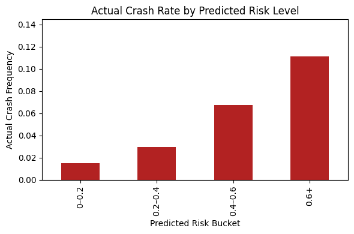
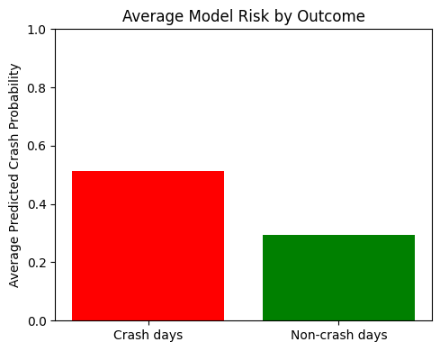
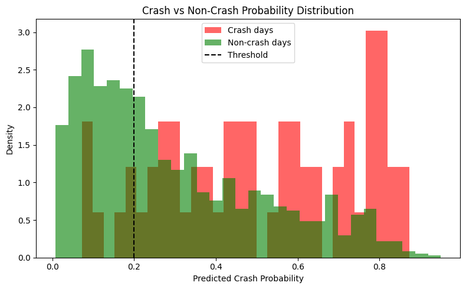
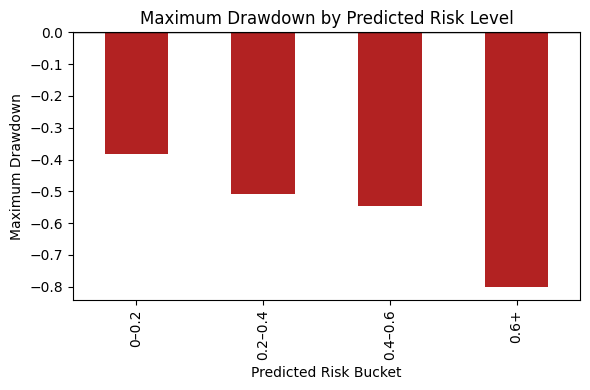

# Tail Risk / Crash Probability Streamlit UI

## Run (VS Code)
```bash
python -m venv .venv
# Windows:
.venv\Scripts\activate
# macOS/Linux:
source .venv/bin/activate

pip install -r requirements.txt
streamlit run app.py
```
# Tail Risk Prediction

This project explores how we can attempt to alert a user to an upcoming market crash.  
Here, a *crash* has a specific operational definition: on any given day, a crash is defined as a price drop of **more than 5%** in the listed equity over the **next 10 trading days**.

Rather than predicting prices directly, the goal is to estimate the *probability of a tail event* and study how realized downside risk behaves when the model signals elevated crash risk.

---

## Motivation

Large market drawdowns are rare, but their impact is disproportionate. Traditional risk metrics based on averages or volatility often fail to capture the probability and severity of extreme downside events. For an investor or trader, the more relevant question is not just *how volatile* an asset is, but *how likely it is to experience a sharp negative move in the near future*.

This project is motivated by the idea that tail events can be framed probabilistically and that historical market behavior may contain signals that help distinguish lower-risk regimes from higher crash-risk regimes. Rather than forecasting returns directly, the focus is on identifying periods where the likelihood of a significant downside move is elevated.

---

## Methodology

The workflow follows a predictive-then-analytical structure:

- Historical equity return data is processed into rolling features that summarize recent market behavior.
- A supervised learning model is trained to estimate the probability of a future crash event, based on the project’s crash definition.
- Each observation is assigned a predicted crash risk score.
- Observations are grouped into discrete risk buckets based on predicted risk.
- Post-prediction analysis is performed to study how realized crash frequency, drawdowns, and risk characteristics vary across these buckets.

The emphasis is not on optimizing point forecasts, but on understanding how predicted tail risk aligns with realized downside outcomes.

---

## Results

### Average Crash Frequency by Risk Bucket
This plot shows how the realized frequency of crash events varies across predicted risk buckets. Higher predicted risk buckets exhibit a higher observed incidence of crash events, indicating meaningful separation between risk regimes.



---

### Average Crash Prediction
This visualization shows the average predicted crash probability for each risk bucket, confirming that the bucketing process produces a monotonic ordering of model-implied risk.



---

### Crash Probability Distribution
The distribution of predicted crash probabilities highlights the concentration of observations in lower-risk regimes, with a smaller but distinct tail corresponding to high-risk periods.



---

### Maximum Drawdown by Predicted Risk Level
This plot illustrates how realized downside risk, measured via maximum drawdown over the forward window, increases with predicted crash risk. Higher-risk buckets are associated with materially worse drawdowns.



---

## Repository Structure

```text
notebooks/   – exploratory analysis and model experiments
src/         – core scripts and supporting logic
results/     – generated plots and visualizations

How to Run:

Install the required dependencies:

pip install -r requirements.txt

The primary analysis and experiments are contained in the notebook, which walks through data preparation, model training, and post-prediction evaluation.

Raw datasets and trained model artifacts are intentionally excluded from the repository.